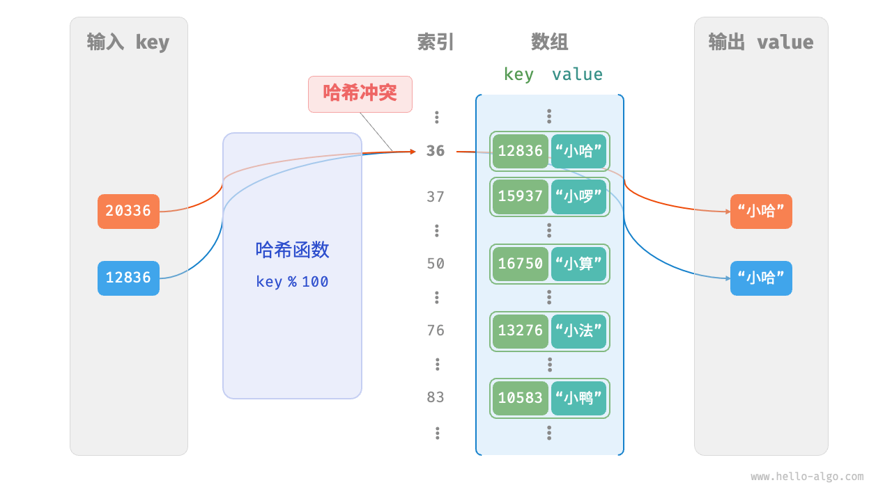

## 1 定义

「哈希表 hash table」，又称「散列表」，它通过建立键 `key` 与值 `value` 之间的映射，实现高效的元素查询。具体而言，我们向哈希表中输入一个键 `key` ，则可以在 $O(1)$ 时间内获取对应的值 `value` 。

如下图所示，给定 $n$ 个学生，每个学生都有“姓名”和“学号”两项数据。假如我们希望实现“输入一个学号，返回对应的姓名”的查询功能，则可以采用下图所示的哈希表来实现。


除哈希表外，数组和链表也可以实现查询功能，它们的效率对比如下表所示。

- **添加元素**：仅需将元素添加至数组（链表）的尾部即可，使用 $O(1)$ 时间。
- **查询元素**：由于数组（链表）是乱序的，因此需要遍历其中的所有元素，使用 $O(n)$ 时间。
- **删除元素**：需要先查询到元素，再从数组（链表）中删除，使用 $O(n)$ 时间。

|          | 数组   | 链表   | 哈希表 |
| -------- | ------ | ------ | ------ |
| 查找元素 | $O (n)$ | $O (n)$ | $O (1)$ |
| 添加元素 | $O (1)$ | $O (1)$ | $O (1)$ |
| 删除元素 | $O (n)$ | $O (n)$ | $O (1)$ |

观察发现，**在哈希表中进行增删查改的时间复杂度都是 $O (1)$** ，非常高效。

## 2 哈希表常用操作

哈希表的常见操作包括：初始化、查询操作、添加键值对和删除键值对等，示例代码如下：

```cpp title="hash_map. Cpp"
/* 初始化哈希表 */
unordered_map<int, string> map;

/* 添加操作 */
// 在哈希表中添加键值对 (key, value)
Map[12836] = "小哈";
Map[15937] = "小啰";
Map[16750] = "小算";
Map[13276] = "小法";
Map[10583] = "小鸭";

/* 查询操作 */
// 向哈希表中输入键 key ，得到值 value
String name = map[15937];

/* 删除操作 */
// 在哈希表中删除键值对 (key, value)
Map.Erase (10583);
```

哈希表有三种常用的遍历方式：遍历键值对、遍历键和遍历值。示例代码如下：

```cpp title="hash_map. Cpp"
/* 遍历哈希表 */
// 遍历键值对 key->value
For (auto kv: map) {
	cout << kv.first << " -> " << kv. Second << endl;
}
// 使用迭代器遍历 key->value
For (auto iter = map.Begin (); iter != map.End (); iter++) {
	cout << iter->first << "->" << iter->second << endl;
}
```


## 3 哈希表简单实现

我们先考虑最简单的情况，**仅用一个数组来实现哈希表**。在哈希表中，我们将数组中的每个空位称为「桶 bucket」，每个桶可存储一个键值对。因此，查询操作就是找到 `key` 对应的桶，并在桶中获取 `value` 。

那么，如何基于 `key` 定位对应的桶呢？这是通过「哈希函数 hash function」实现的。哈希函数的作用是将一个较大的输入空间映射到一个较小的输出空间。在哈希表中，输入空间是所有 `key` ，输出空间是所有桶（数组索引）。换句话说，输入一个 `key` ，**我们可以通过哈希函数得到该 `key` 对应的键值对在数组中的存储位置**。

输入一个 `key` ，哈希函数的计算过程分为以下两步。

1. 通过某种哈希算法 `hash ()` 计算得到哈希值。
2. 将哈希值对桶数量（数组长度）`capacity` 取模，从而获取该 `key` 对应的数组索引 `index` 。

```cpp
Index = hash (key) % capacity
```

随后，我们就可以利用 `index` 在哈希表中访问对应的桶，从而获取 `value` 。

设数组长度 `capacity = 100`、哈希算法 `hash (key) = key` ，易得哈希函数为 `key % 100` 。下图以 `key` 学号和 `value` 姓名为例，展示了哈希函数的工作原理。


以下代码实现了一个简单哈希表。其中，我们将 `key` 和 `value` 封装成一个类 `Pair` ，以表示键值对。

```cpp
/* 键值对 */
struct Pair {
  public:
    int key;
    string val;
    Pair(int key, string val) {
        this->key = key;
        this->val = val;
    }
};

/* 基于数组实现的哈希表 */
class ArrayHashMap {
  private:
    vector<Pair *> buckets;

  public:
    ArrayHashMap() {
        // 初始化数组，包含 100 个桶
        buckets = vector<Pair *>(100);
    }

    ~ArrayHashMap() {
        // 释放内存
        for (const auto &bucket : buckets) {
            delete bucket;
        }
        buckets.clear();
    }

    /* 哈希函数 */
    int hashFunc(int key) {
        int index = key % 100;
        return index;
    }

    /* 查询操作 */
    string get(int key) {
        int index = hashFunc(key);
        Pair *pair = buckets[index];
        if (pair == nullptr)
            return "";
        return pair->val;
    }

    /* 添加操作 */
    void put(int key, string val) {
        Pair *pair = new Pair(key, val);
        int index = hashFunc(key);
        buckets[index] = pair;
    }

    /* 删除操作 */
    void remove(int key) {
        int index = hashFunc(key);
        // 释放内存并置为 nullptr
        delete buckets[index];
        buckets[index] = nullptr;
    }

    /* 获取所有键值对 */
    vector<Pair *> pairSet() {
        vector<Pair *> pairSet;
        for (Pair *pair : buckets) {
            if (pair != nullptr) {
                pairSet.push_back(pair);
            }
        }
        return pairSet;
    }

    /* 获取所有键 */
    vector<int> keySet() {
        vector<int> keySet;
        for (Pair *pair : buckets) {
            if (pair != nullptr) {
                keySet.push_back(pair->key);
            }
        }
        return keySet;
    }

    /* 获取所有值 */
    vector<string> valueSet() {
        vector<string> valueSet;
        for (Pair *pair : buckets) {
            if (pair != nullptr) {
                valueSet.push_back(pair->val);
            }
        }
        return valueSet;
    }

    /* 打印哈希表 */
    void print() {
        for (Pair *kv : pairSet()) {
            cout << kv->key << " -> " << kv->val << endl;
        }
    }
};
```

## 4 哈希冲突与扩容

从本质上看，哈希函数的作用是将所有 `key` 构成的输入空间映射到数组所有索引构成的输出空间，而输入空间往往远大于输出空间。因此，**理论上一定存在“多个输入对应相同输出”的情况**。

对于上述示例中的哈希函数，当输入的 `key` 后两位相同时，哈希函数的输出结果也相同。例如，查询学号为 12836 和 20336 的两个学生时，我们得到：

```shell
12836 % 100 = 36
20336 % 100 = 36
```

如下图所示，两个学号指向了同一个姓名，这显然是不对的。我们将这种多个输入对应同一输出的情况称为「哈希冲突 hash collision」。



容易想到，哈希表容量 $n$ 越大，多个 `key` 被分配到同一个桶中的概率就越低，冲突就越少。因此，**我们可以通过扩容哈希表来减少哈希冲突**。

如下图所示，扩容前键值对 `(136, A)` 和 `(236, D)` 发生冲突，扩容后冲突消失。


类似于数组扩容，哈希表扩容需将所有键值对从原哈希表迁移至新哈希表，非常耗时；并且由于哈希表容量 `capacity` 改变，我们需要通过哈希函数来重新计算所有键值对的存储位置，这进一步增加了扩容过程的计算开销。为此，编程语言通常会预留足够大的哈希表容量，防止频繁扩容。

「负载因子 load factor」是哈希表的一个重要概念，其定义为哈希表的元素数量除以桶数量，用于衡量哈希冲突的严重程度，**也常作为哈希表扩容的触发条件**。例如在 Java 中，当负载因子超过 $0.75$ 时，系统会将哈希表扩容至原先的 $2$ 倍。

### 4.1 哈希冲突


>[! note]- 哈希冲突
> ![[哈希冲突]]


## 5 哈希算法

>[! note]- 哈希算法
>![[哈希算法]]


## 6 总结

### 6.1 重点回顾

- 输入 `key` ，哈希表能够在 $O(1)$ 时间内查询到 `value` ，效率非常高。
- 常见的哈希表操作包括查询、添加键值对、删除键值对和遍历哈希表等。
- 哈希函数将 `key` 映射为数组索引，从而访问对应桶并获取 `value` 。
- 两个不同的 `key` 可能在经过哈希函数后得到相同的数组索引，导致查询结果出错，这种现象被称为哈希冲突。
- 哈希表容量越大，哈希冲突的概率就越低。因此可以通过扩容哈希表来缓解哈希冲突。与数组扩容类似，哈希表扩容操作的开销很大。
- 负载因子定义为哈希表中元素数量除以桶数量，反映了哈希冲突的严重程度，常用作触发哈希表扩容的条件。
- 链式地址通过将单个元素转化为链表，将所有冲突元素存储在同一个链表中。然而，链表过长会降低查询效率，可以通过进一步将链表转换为红黑树来提高效率。
- 开放寻址通过多次探测来处理哈希冲突。线性探测使用固定步长，缺点是不能删除元素，且容易产生聚集。多次哈希使用多个哈希函数进行探测，相较线性探测更不易产生聚集，但多个哈希函数增加了计算量。
- 不同编程语言采取了不同的哈希表实现。例如，Java 的 `HashMap` 使用链式地址，而 Python 的 `Dict` 采用开放寻址。
- 在哈希表中，我们希望哈希算法具有确定性、高效率和均匀分布的特点。在密码学中，哈希算法还应该具备抗碰撞性和雪崩效应。
- 哈希算法通常采用大质数作为模数，以最大化地保证哈希值均匀分布，减少哈希冲突。
- 常见的哈希算法包括 MD5、SHA-1、SHA-2 和 SHA-3 等。MD5 常用于校验文件完整性，SHA-2 常用于安全应用与协议。
- 编程语言通常会为数据类型提供内置哈希算法，用于计算哈希表中的桶索引。通常情况下，只有不可变对象是可哈希的。

### 6.2 Q & A

**Q**：哈希表的时间复杂度在什么情况下是 $O(n)$ ？

当哈希冲突比较严重时，哈希表的时间复杂度会退化至 $O(n)$ 。当哈希函数设计得比较好、容量设置比较合理、冲突比较平均时，时间复杂度是 $O(1)$ 。我们使用编程语言内置的哈希表时，通常认为时间复杂度是 $O(1)$ 。

**Q**：为什么不使用哈希函数 $f(x) = x$ 呢？这样就不会有冲突了。

在 $f(x) = x$ 哈希函数下，每个元素对应唯一的桶索引，这与数组等价。然而，输入空间通常远大于输出空间（数组长度），因此哈希函数的最后一步往往是对数组长度取模。换句话说，哈希表的目标是将一个较大的状态空间映射到一个较小的空间，并提供 $O(1)$ 的查询效率。

**Q**：哈希表底层实现是数组、链表、二叉树，但为什么效率可以比它们更高呢？

首先，哈希表的时间效率变高，但空间效率变低了。哈希表有相当一部分内存未使用。

其次，只是在特定使用场景下时间效率变高了。如果一个功能能够在相同的时间复杂度下使用数组或链表实现，那么通常比哈希表更快。这是因为哈希函数计算需要开销，时间复杂度的常数项更大。

最后，哈希表的时间复杂度可能发生劣化。例如在链式地址中，我们采取在链表或红黑树中执行查找操作，仍然有退化至 $O(n)$ 时间的风险。

**Q**：多次哈希有不能直接删除元素的缺陷吗？标记为已删除的空间还能再次使用吗？

多次哈希是开放寻址的一种，开放寻址法都有不能直接删除元素的缺陷，需要通过标记删除。标记为已删除的空间可以再次使用。当将新元素插入哈希表，并且通过哈希函数找到标记为已删除的位置时，该位置可以被新元素使用。这样做既能保持哈希表的探测序列不变，又能保证哈希表的空间使用率。

**Q**：为什么在线性探测中，查找元素的时候会出现哈希冲突呢？

查找的时候通过哈希函数找到对应的桶和键值对，发现 `key` 不匹配，这就代表有哈希冲突。因此，线性探测法会根据预先设定的步长依次向下查找，直至找到正确的键值对或无法找到跳出为止。

**Q**：为什么哈希表扩容能够缓解哈希冲突？

哈希函数的最后一步往往是对数组长度 $n$ 取模（取余），让输出值落在数组索引范围内；在扩容后，数组长度 $n$ 发生变化，而 `key` 对应的索引也可能发生变化。原先落在同一个桶的多个 `key` ，在扩容后可能会被分配到多个桶中，从而实现哈希冲突的缓解。


